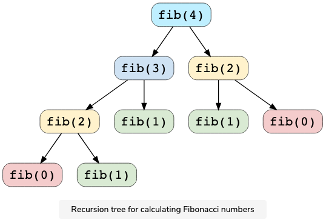

# Dynamic Programming (DP)
## DP Introduction
**Dynamic Programming (DP)** is an algorithmic technique for **solving an optimization problem by breaking it down into simpler subproblems** and **utilizing the fact that the optimal solution to the overall problem depends upon the optimal solution to its subproblems**.

We can understand the word "programming" here as "recurrence" , so `Dynamic Programming == Dynamic Recurrence`.

Dynamic Programming Methods：
1. Top-down with memorization (Recursion + Memorization)
2. Bottom-up with tabulation.

Two keypoints about DP (whether the problem is suitable for DP):
1. Optimal substructure - means that the solution to a given optimization problem can be obtained by the combination of optimal solutions to its sub-problems.
2. Overlapping sub-problems - means that the space of sub-problems must be small, that is, any recursive algorithm solving the problem should solve the same sub-problems over and over, rather than generating new sub-problems.

动态规划三要素:
重叠子问题、最优子结构、状态转移方程

## DP Problem Solving Process

1. Define states - 1D array, 2D array.
2. Recurrence formulation (state transition equation) - Write down the formula to calculate recurrence status. For example `dp[n] = best_of(dp[n-1], dp[n-2], ...)`
3. Initialization - Initialize state array values.

动态规划问题的一般形式就是求最值。
动态规划的题目分为两大类:
一种是求**最优解**类，典型问题是背包问题，另一种就是**计数**类，比如统计方案数的问题，它们都存在一定的递推性质。前者的递推性质还有一个名字，叫做**最优子结构**，即当前问题的最优解取决于子问题的最优解，后者类似，当前问题的方案数取决于子问题的方案数。所以在遇到求方案数的问题时，我们可以往动态规划的方向考虑。

思维框架:
明确 base case -> 明确「状态」-> 明确「选择」 -> 定义 dp 数组/函数的含义。

DP template:
``` Python
# 初始化 base case
dp[0][0][...] = base
# 进行状态转移
for 状态1 in 状态1的所有取值：
    for 状态2 in 状态2的所有取值：
        for ...
            dp[状态1][状态2][...] = 求最值(选择1，选择2...)
```

**状态压缩**: 如果我们发现每次状态转移只需要 DP table 中的一部分，那么可以尝试用状态压缩来缩小 DP table 的大小，只记录必要的数据。

## Fibonacci Numbers
Fibonacci numbers are a series of numbers in which each number is the sum of the two preceding numbers.
The equation is as follows:

```
Fib(n) = Fib(n-1) + Fib(n-2), for n > 1
```
### Overlapping Subproblems
Subproblems are smaller versions of the original problem. Any problem has overlapping sub-problems if finding its solution involves solving the same subproblem multiple times.

For the Fibonacci numbers, such as finding f(4), we need to break down to the following sub-problems:


We can see that there are overlapping sub-problems such as fib(2), which is evaluated twice.

### Optimal Substructure Property
Any problem has optimal substructure property if its overall optimal solution can be constructed from the optimal solutions of its subproblems.

For Fibonacci numbers:
```
Fib(n) = Fib(n-1) + Fib(n-2)
```

## Compare Back-tracking, Greedy and DP

* Back-tracking (recursion) - Enumerate all possible situations, for some problems, there are duplicated calculations.
* Greedy - Local optimal, local optimal could get golbal optimal.
* DP - Record local optimal sub-structure (to avoid duplicated calculations) / record mutiple values (for the state transition equation).

## Reference
1. [Grokking Dynamic Programming Patterns for Coding Interview](https://www.educative.io/courses/grokking-dynamic-programming-patterns-for-coding-interviews/m2G1pAq0OO0)
2. [LeetCode Unique Paths II](https://leetcode-cn.com/problems/unique-paths-ii/solution/bu-tong-lu-jing-ii-by-leetcode-solution-2/)
3. [动态规划详解](https://labuladong.github.io/algo/%E5%8A%A8%E6%80%81%E8%A7%84%E5%88%92%E7%B3%BB%E5%88%97/%E5%8A%A8%E6%80%81%E8%A7%84%E5%88%92%E8%AF%A6%E8%A7%A3%E8%BF%9B%E9%98%B6.html)